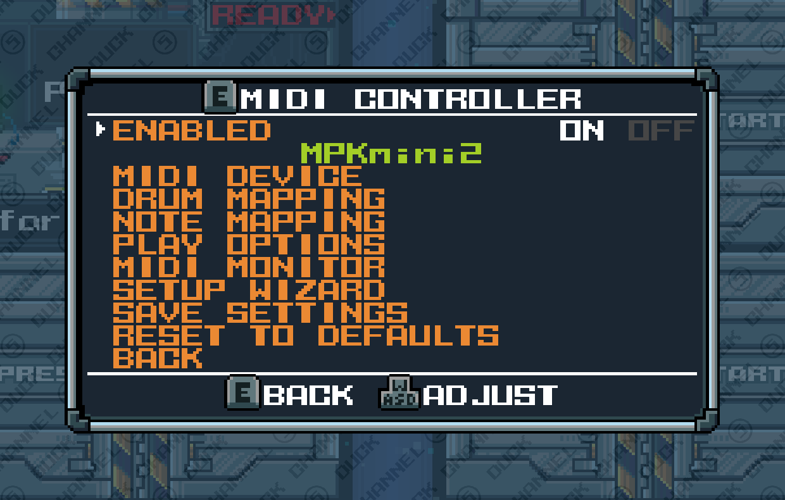
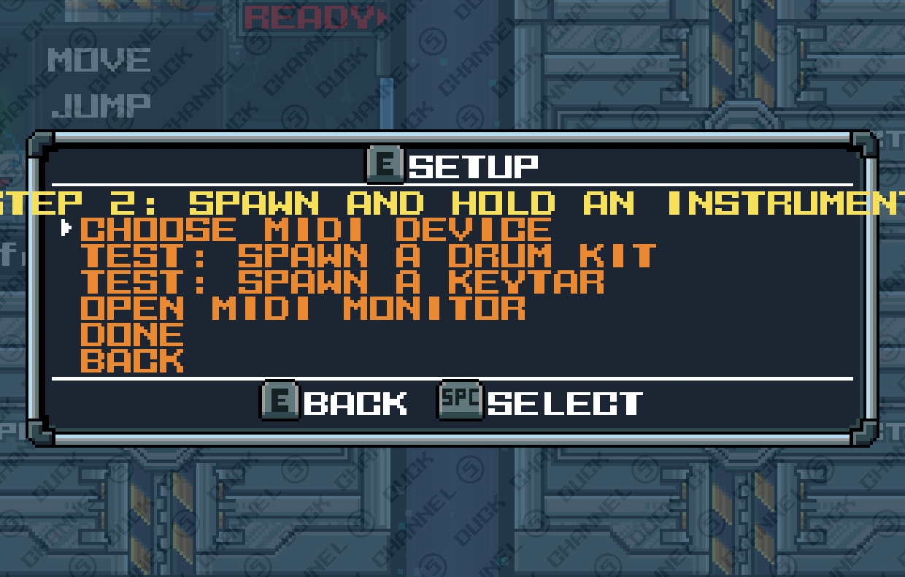
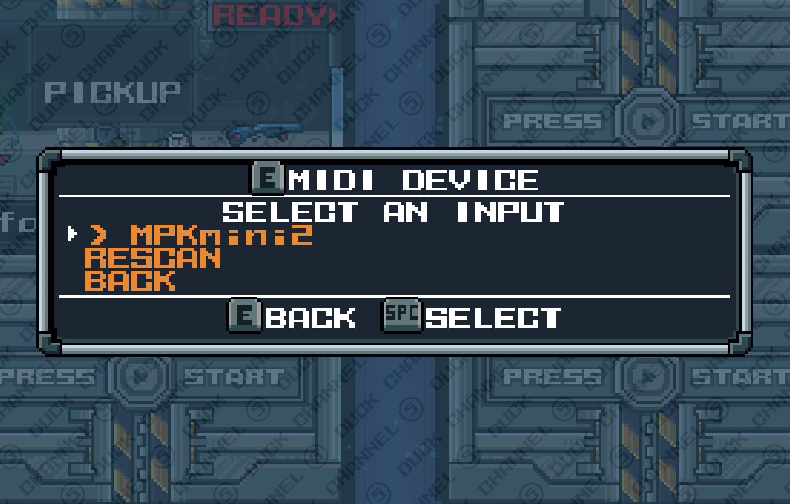
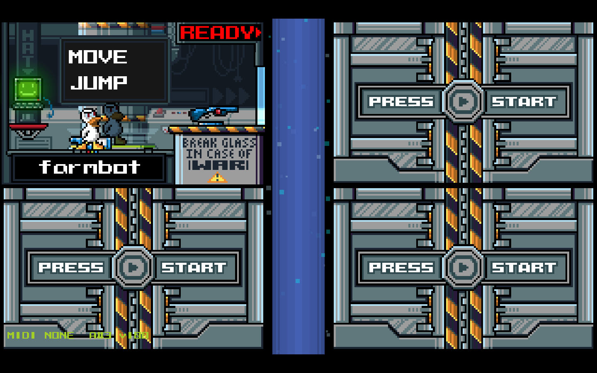
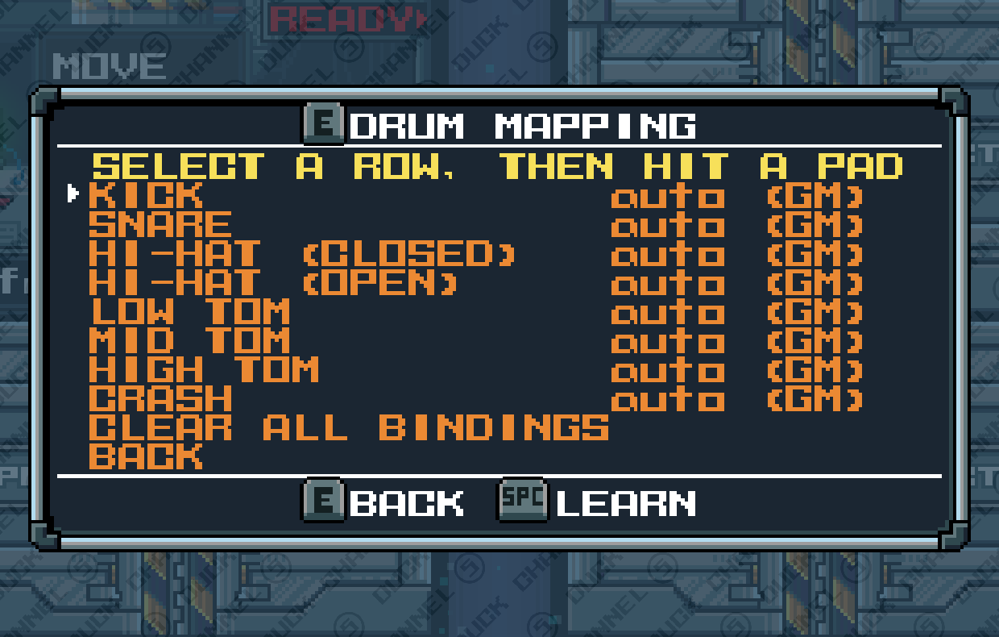
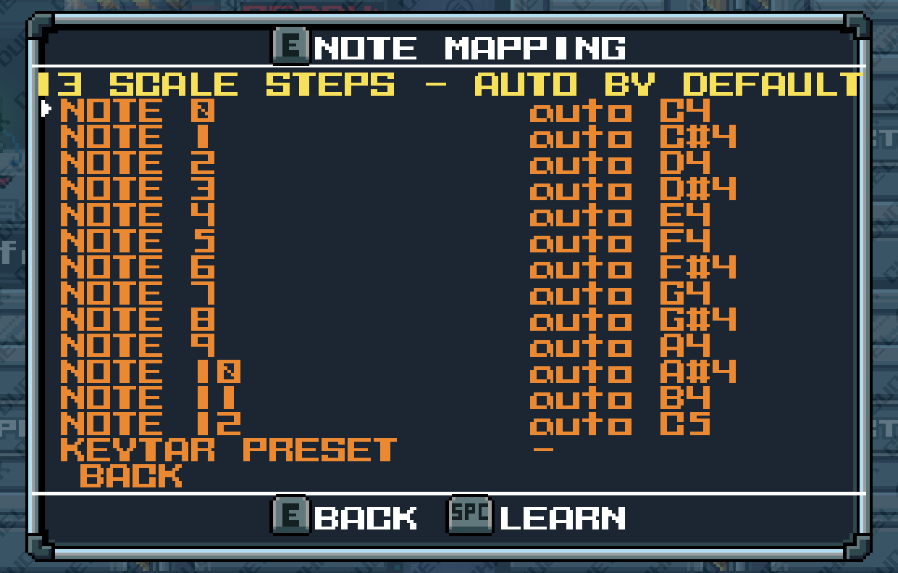
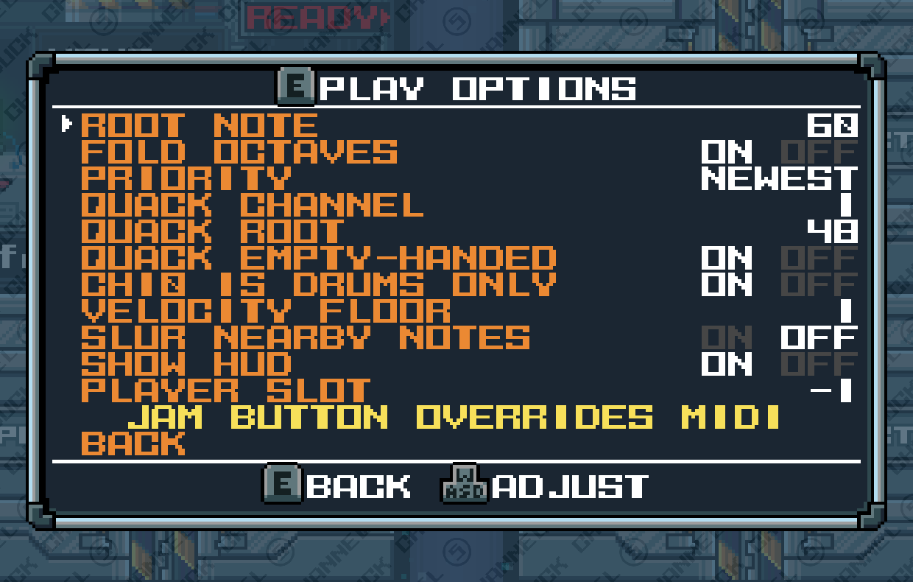
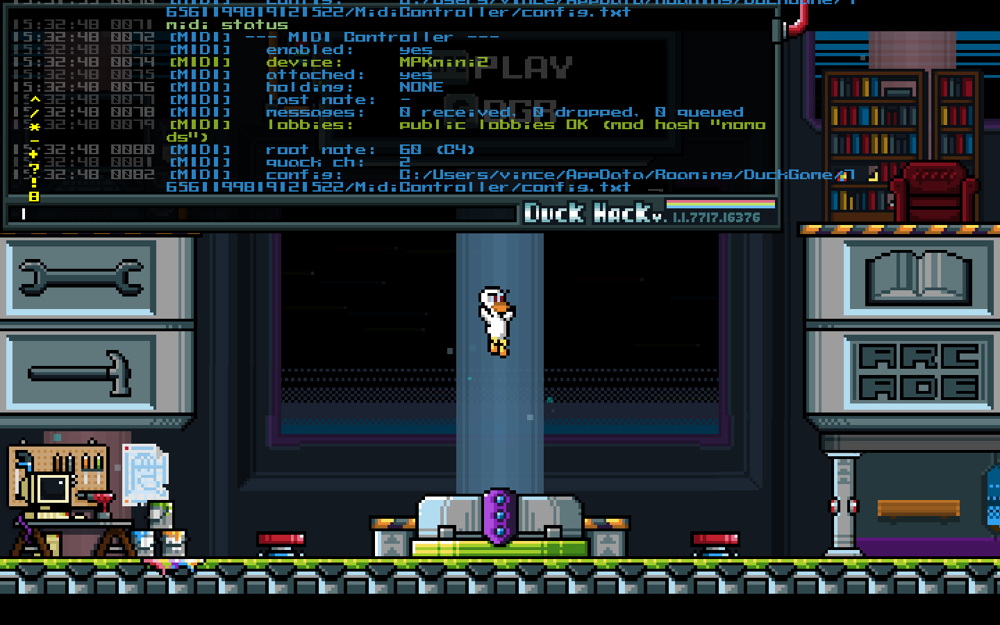
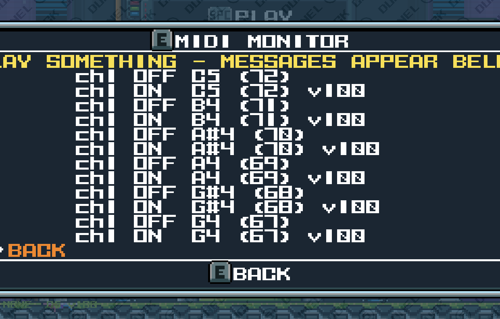

# Duck Game MIDI Controller

Play Duck Game's instruments with a real MIDI keyboard, beat machine, or pad controller.

Drum kit, keytar, saxophone, trombone, trumpet — plus pitched quacks. Plug in, pick up an
instrument, play. **Other players hear your performance even if they don't have the mod,
and you can still join public lobbies.**



---

## What it does

| You play | Duck Game does |
|---|---|
| Pads / General MIDI drum notes | Kick, snare, hi-hat (open + closed), 3 toms, crash |
| Keyboard, while holding sax or trombone | The full 13-note range |
| Keyboard, while holding a keytar | 13 notes across 5 switchable presets, with pitch bend |
| Keyboard, while holding a trumpet | Its 4 valve pitches |
| Anything on the quack channel | A pitched quack — always, whatever you're holding |

It auto-routes: the mod looks at what your duck is holding and sends notes to the right
place. Pads go to drums, keys go to the melodic instrument. No configuration needed to
start.

## Install

**From the Steam Workshop** — subscribe, then enable *MIDI Controller* in the game's
Mods menu and restart. That's it; there is nothing to download or configure.

**Manually** — copy this folder into:

```
%APPDATA%\DuckGame\<your SteamID64>\Mods\DuckGameMidiController\
```

The mod ships as C# source and Duck Game compiles it at startup, so it works on both
the stock Steam build and Duck Game Rebuilt with no separate download.

## Using it

Plug your controller in **before** launching, and it connects on its own — no setup step.
If you plug in later, it's picked up within a couple of seconds.

1. Start any match.
2. Open the console with `` ` `` and type `midi spawn drums` (or `sax`, `keytar`,
   `trombone`, `trumpet`).
3. Grab the instrument and play.

Press **F9** for settings, or type `midi settings`.

First time in, the setup wizard walks you through it and tracks where you've got to:



Devices are picked automatically, but you can choose one if you have several. The
connected input is marked, and the list refreshes as hardware comes and goes:



While you play, a small HUD in the corner shows the held instrument and the last note, so
you can tell at a glance that it's working. It fades out when you stop:



No controller handy? `midi test scale`, `midi test drums` and `midi test quack` play
synthetic notes through the whole pipeline — useful for checking the mod works before
troubleshooting your hardware.

## Default mapping

**Drums** follow the General MIDI percussion map, so most beat machines work untouched:

| GM note | Voice |
|---|---|
| 35, 36 | Kick |
| 37, 38, 39, 40 | Snare |
| 42, 44 | Hi-hat (closed) |
| 46 | Hi-hat (open) |
| 41, 43 | Low tom |
| 45, 47 | Mid tom |
| 48, 50 | High tom |
| 49, 51, 52, 53, 55, 57, 59 | Crash |

Any drum note that isn't listed snaps to the nearest one that is, so no pad is ever silent.

**Melodic** instruments map from a root note, C4 (60) by default. C4–C5 covers all 13
steps. Notes outside that range fold back into it unless you turn *Fold Octaves* off.

**Quack** listens on its own MIDI channel — channel 2 by default — so you can quack a
bassline underneath a saxophone solo. It's also what plays if you're holding nothing.

Everything is remappable: **Settings → Drum Mapping / Note Mapping**, select a row, then
hit the pad or key you want on it. Rows left alone stay on the automatic routing, shown as
`auto`:





## Settings

| Setting | What it does |
|---|---|
| Root note | Which MIDI note is scale step 0 |
| Fold octaves | Notes outside the range wrap into it instead of being ignored |
| Priority | Which held key sounds when you play more than one: newest, highest or lowest |
| Quack channel | MIDI channel reserved for quacks (−1 disables) |
| Quack root | Which note is an unpitched quack |
| Ch10 is drums only | Ignore General MIDI drum notes while holding a melodic instrument |
| Velocity floor | Ignore notes softer than this — helps with over-sensitive pads |
| Slur nearby notes | Glide between adjacent notes instead of re-articulating |
| Show HUD | The small status readout during play |
| Player slot | Which local player to drive in splitscreen |



## Console commands

```
midi status              connection and routing state
midi devices             list MIDI inputs
midi device <n|name>     select an input
midi on | off            enable or disable note injection
midi spawn <instrument>  drop an instrument next to you (host/offline only)
midi spawn clear         remove instruments you spawned
midi settings            open settings (same as F9)
midi wizard              re-run first-time setup
midi test <what>         scale | drums | quack | a note number
midi panic               stop all notes
midi save|reload|reset   settings file operations
```

Settings live in `%APPDATA%\DuckGame\<SteamID64>\MidiController\config.txt`. It's plain
text and safe to hand-edit — handy for sharing a mapping.

## Multiplayer

**Public lobbies work, and nobody else needs the mod.**

Notes reach other players through Duck Game's own networking — melodic instruments
replicate `notePitch` via `StateBinding`, drums via `NetSoundEffect`, quacks via
`quackPitch`. What arrives on their machine is byte-identical to a human playing the same
notes on a keyboard.

### How it stays joinable

Duck Game refuses to join a lobby unless your *mod hash* matches the host's. That hash is
a **content-compatibility** check — its job is to stop mods that add items, weapons or
network messages from desyncing a lobby. Left alone, installing any mod at all locks you
out of every public lobby.

This mod removes itself from that hash at load time, so your client is indistinguishable
from an unmodded one. That's legitimate here because the mod is genuinely content-free:

- it declares **no** `Thing`, `AmmoType`, `DestroyType` or `NetMessage` subclasses, so the
  separate `datahash` (`messageTypeHash + Editor.thingTypesHash`) is untouched;
- it only synthesizes **local input for your own duck**, and only instrument and quack
  triggers — never movement, never firing a real weapon;
- Duck Game's own developers keep a hardcoded exemption list (`brokenclientsidemods`) for
  exactly this category of client-side mod. That list lives in the game binary and can't
  be added to from outside, so dropping out of the accessible-mod list is the equivalent.

Check it any time with `midi status` — `"nomods"` means lobbies see an unmodded client:



**The honest trade-off:** because the mod is excluded from the hash, it also doesn't
appear in a lobby's mod list, so a host enforcing a strict "no mods" policy can't see it.
If you'd rather be strictly visible, set `lobbyCompat=false` in the config — you'll then
only be able to join lobbies whose mod set matches yours exactly.

If you have *other* mods installed, those still count toward the hash as normal; this only
removes itself.

## Troubleshooting

**Nothing happens when I play.** Open **Settings → MIDI Monitor** and play a key. This is
the fastest way to split the problem in half:



If messages appear there, the mod is receiving fine and the issue is mapping — check
you're holding an instrument, and check the root note. If nothing appears, the mod isn't
receiving at all: run `midi devices`, and make sure no other application has the port open
(MIDI inputs on Windows are exclusive — a DAW will lock the device).

**It worked, then stopped.** `midi panic`, then play again.

**The wrong notes play on sax/trombone.** The game's own "jam" register lock (the
VOICEREG button) overrides MIDI note selection while it's on. Toggle it off.

**Only the first of a fast run sounds.** See the limitations below.

## Known limitations

These are properties of Duck Game itself, not bugs in the mod:

- **Windows only.** MIDI input uses winmm, which doesn't exist on Linux or macOS. The
  mod loads and stays quiet rather than failing.
- **Open hi-hat sounds *closed* to other players.** The game broadcasts the wrong sound
  for the open hat. Locally it's correct.
- **A ~17ms gap between consecutive sax/trombone notes.** Those two instruments only
  start a new sample once the previous one has stopped, so a note has to be released
  before the next can articulate. Audible on fast runs. *Slur nearby notes* avoids it for
  steps a semitone apart.
- **Quack pitch only bends upward,** about an octave — the game stores it in a byte.
- **Trumpet has only 4 pitches.** That's all the samples the game has.
- **Motion/gyro control is unavailable while an instrument is held.**

## Building and contributing

There is no build step — Duck Game compiles the source at startup. But the in-game
compiler is **C# 5**, so no string interpolation, `?.`, expression-bodied members,
`nameof`, tuples or pattern matching.

```powershell
# link the repo into the game's Mods folder
powershell -ExecutionPolicy Bypass -File tools\install-dev.ps1

# reproduce the in-game compile locally, against both game builds
powershell -ExecutionPolicy Bypass -File tools\check-compile.ps1
```

`check-compile.ps1` drives the same `csc.exe` the game uses, against both the vanilla and
Rebuilt installs. Run it before every commit — it catches in seconds what would otherwise
mean launching the game.

See [CONTRIBUTING.md](CONTRIBUTING.md) for more.

## Licence

MIT — see [LICENSE](LICENSE).

Duck Game is © Landon Podbielski. This is an unofficial community mod.
